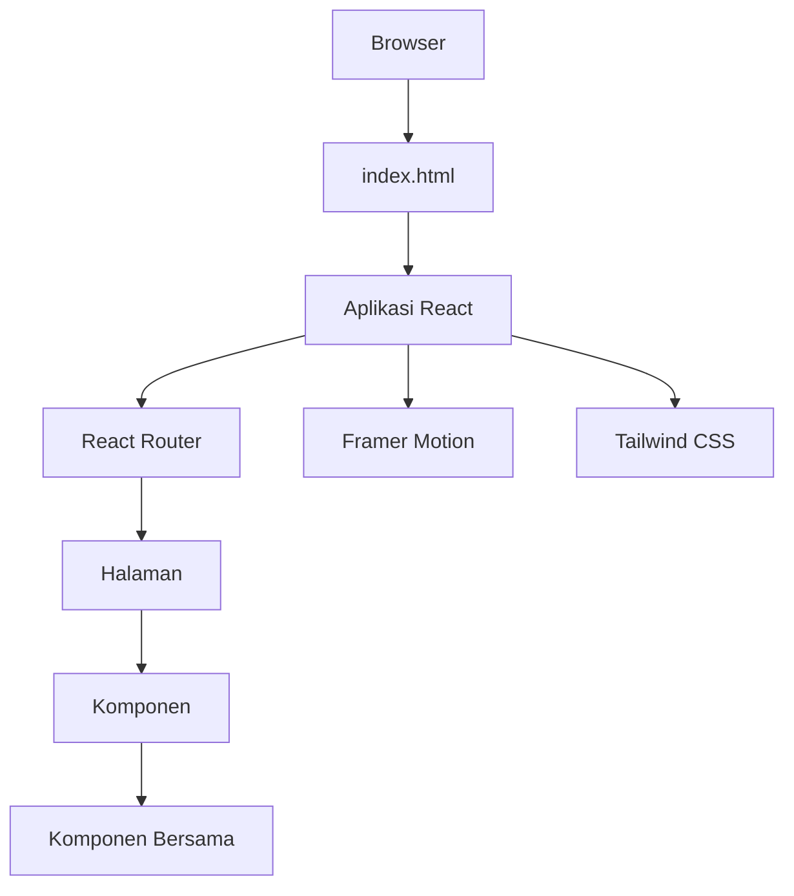
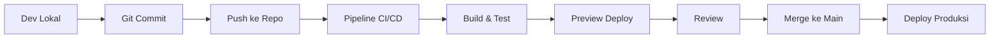

# Arsitektur Sistem OurCreativities

> Dokumentasi arsitektur teknis platform OurCreativities v5.0

## Ringkasan

OurCreativities dibangun sebagai *Single Page Application* (SPA) menggunakan React dengan routing di sisi klien (*client-side*). Arsitektur dirancang untuk skalabilitas, kemudahan pemeliharaan (*maintainability*), dan performa optimal.

## Arsitektur Tingkat Tinggi



## Struktur Folder

```
ourcreativities/
├── components/           # Komponen yang dapat digunakan kembali
│   ├── BentoGrid.tsx
│   ├── BottomCTA.tsx
│   ├── Footer.tsx
│   ├── Hero.tsx
│   └── Navbar.tsx
├── pages/               # Halaman utama aplikasi
│   ├── Home.tsx
│   ├── Karya.tsx
│   ├── Tim.tsx
│   ├── Story.tsx
│   └── Info.tsx
├── docs/                # Dokumentasi
│   ├── versions/        # Riwayat versi
│   ├── ARSITEKTUR.md    # File ini
│   ├── KOMPONEN.md
│   ├── HALAMAN.md
│   ├── PANDUAN_DEPLOYMENT.md
│   └── KONTRIBUSI.md
├── App.tsx              # Komponen Root
├── index.tsx            # Titik Masuk (Entry point)
├── index.html           # Template HTML
├── index.css            # Gaya Global
├── vite.config.ts       # Konfigurasi Vite
├── tsconfig.json        # Konfigurasi TypeScript
└── package.json         # Dependensi
```

## Arsitektur Komponen

### Hierarki Komponen

```
App
├── ScrollToTop (Utilitas)
├── Background Ambience (Visual)
├── Navbar (Navigasi)
├── Main (Wadah Konten)
│   └── AnimatedRoutes
│       ├── Home
│       │   ├── Hero
│       │   ├── BentoGrid
│       │   └── BottomCTA
│       ├── Karya
│       ├── Tim
│       ├── Story
│       └── Info
└── Footer
```

### Jenis Komponen

**Komponen Tata Letak:**
- `App.tsx` - Wadah utama (*Root container*)
- `Navbar.tsx` - Bilah navigasi
- `Footer.tsx` - Kaki halaman (*Page footer*)

**Komponen Konten:**
- `Hero.tsx` - Bagian Hero (utama)
- `BentoGrid.tsx` - Tata letak Grid
- `BottomCTA.tsx` - Ajakan bertindak (*Call-to-action*)

**Komponen Halaman:**
- `pages/Home.tsx`
- `pages/Karya.tsx`
- `pages/Tim.tsx`
- `pages/Story.tsx`
- `pages/Info.tsx`

## Sistem Routing

### Implementasi React Router

**Tipe Router:** MemoryRouter
- Alasan: SPA tanpa routing sisi server (*server-side routing*)
- Navigasi sisi klien (*Client-side navigation*)
- Tidak ada persistensi URL (dapat diubah ke BrowserRouter jika diperlukan)

**Konfigurasi Rute:**
```typescript
<Routes>
  <Route path="/" element={<Home />} />
  <Route path="/karya" element={<Karya />} />
  <Route path="/tim" element={<Tim />} />
  <Route path="/story" element={<Story />} />
  <Route path="/info" element={<Info />} />
  <Route path="*" element={<Navigate to="/" />} />
</Routes>
```

**Fitur Rute:**
- Gulir otomatis ke atas (*Automatic scroll to top*)
- Transisi halaman dengan Framer Motion
- Pengalihan 404 ke beranda
- Mode `AnimatePresence` "wait"

## Arsitektur Styling

### Sistem Tailwind CSS

**Konfigurasi:**
- Tailwind CSS berbasis CDN
- Konfigurasi kustom di `index.html`
- Palet warna yang diperluas
- Keluarga font kustom

**Tema Kustom:**
```javascript
{
  colors: {
    background: '#050505',
    surface: '#0f0f0f',
    surfaceHighlight: '#1a1a1a',
    primary: '#ffffff',
    accentRed: '#e11d48',
    accentPurple: '#a855f7'
  },
  fontFamily: {
    sans: ['Inter', 'sans-serif'],
    serif: ['Playfair Display', 'serif']
  }
}
```

### Gaya Global

**index.css:**
- Reset/normalisasi CSS
- Scrollbar kustom
- Animasi global
- Kelas utilitas

**Token Desain:**
- Skala spasi: basis 4px
- Radius batas: default 0.5rem
- Sistem bayangan: 3 tingkat
- Durasi animasi: 200-600ms

## Sistem Animasi

### Framer Motion

**Pola Penggunaan:**

**Transisi Halaman:**
```typescript
<AnimatePresence mode="wait">
  <motion.div
    initial={{ opacity: 0 }}
    animate={{ opacity: 1 }}
    exit={{ opacity: 0 }}
  />
</AnimatePresence>
```

**Animasi Komponen:**
- Animasi masuk (*Entrance animations*)
- Status hover
- Pemicu berbasis gulir (*Scroll-based triggers*)
- Animasi gestur

**Pertimbangan Performa:**
- Gunakan `transform` & `opacity`
- Hindari menganimasikan `width`/`height`
- Akselerasi perangkat keras
- Hormati pengaturan *Reduce motion*

## Manajemen State

### Pendekatan Saat Ini

**State Lokal:**
- React `useState` untuk state komponen
- Belum ada manajemen state global
- *Props drilling* untuk state bersama

**Pertimbangan Masa Depan:**
- Context API untuk tema
- React Query untuk pengambilan data (*data fetching*)
- Zustand/Jotai untuk state global

## Sistem Build

### Konfigurasi Vite

**Fitur:**
- HMR Cepat (*Hot Module Replacement*)
- ESbuild untuk bundling
- Dukungan TypeScript
- Plugin React

**Optimasi Build:**
```typescript
// vite.config.ts
export default defineConfig({
  plugins: [react()],
  build: {
    rollupOptions: {
      output: {
        manualChunks: {
          vendor: ['react', 'react-dom'],
          router: ['react-router-dom'],
          animation: ['framer-motion']
        }
      }
    }
  }
})
```

## Pengaturan TypeScript

**Konfigurasi:**
- Mode ketat (*Strict mode*) diaktifkan
- Tipe React disertakan
- `@types/node` untuk utilitas

**Keamanan Tipe:**
- Props komponen bertipe
- Penangan acara (*Event handlers*) bertipe
- Tidak ada `any` implisit
- Pemeriksaan null ketat

## Strategi Performa

### Teknik Optimasi

**Pemisahan Kode (*Code Splitting*):**
- Pemisahan berbasis rute
- Pemuatan komponen secara malas (*Lazy loading*)
- Pemisahan chunk vendor

**Optimasi Aset:**
- Pemuatan gambar secara malas (*Image lazy loading*)
- Pemuatan awal font (*Font preloading*)
- Petunjuk sumber daya (*Resource hints - preconnect*)
- *Inlining* CSS kritis

**Optimasi Runtime:**
- `React.memo` untuk komponen berat
- `useMemo` untuk kalkulasi
- `useCallback` untuk penangan acara
- Virtualisasi untuk daftar panjang

## Pertimbangan Keamanan

### Implementasi Saat Ini

**Sanitasi Input:**
- Belum ada input pengguna saat ini
- Disiapkan untuk formulir masa depan

**Pencegahan XSS:**
- *Escaping* default React
- Tidak menggunakan `dangerouslySetInnerHTML`

**Dependensi:**
- Pembaruan rutin
- Pemindaian CodeQL
- Pemantauan kerentanan

## Pertimbangan Skalabilitas

### Keterbatasan Saat Ini

**Konten Statis:**
- Data di-*hard-code*
- Tidak ada integrasi CMS
- Pembaruan manual diperlukan

**Jalur Skala Masa Depan:**

**Fase 1: Integrasi CMS**
- Headless CMS (Strapi/Contentful)
- Integrasi API
- UI manajemen konten

**Fase 2: Layanan Backend**
- Otentikasi pengguna
- Integrasi database
- Fitur *real-time*

**Fase 3: Layanan Mikro (*Microservices*)**
- Pemisahan layanan
- API gateway
- Infrastruktur yang dapat diskalakan

## Arsitektur Deployment

**Saat Ini:**
```
Git Push → Build → Deploy → CDN
```

**Stack:**
- Hosting: Vercel/Netlify
- CDN: Otomatis
- SSL: Otomatis
- Domain: Siap untuk domain kustom

## Monitoring & Analitik

**Integrasi Terencana:**
- Google Analytics
- Pelacakan kesalahan Sentry
- Pemantauan Web Vitals
- Analitik perilaku pengguna

## Arsitektur Aksesibilitas

**WCAG 2.1 Level AA:**
- HTML5 Semantik
- Label ARIA
- Navigasi keyboard
- Manajemen fokus
- Kontras warna

## Dukungan Browser

**Browser Target:**
- Chrome 90+
- Firefox 88+
- Safari 14+
- Edge 90+

**Peningkatan Progresif (*Progressive Enhancement*):**
- Deteksi fitur
- Degradasi yang anggun (*Graceful degradation*)
- Strategi Polyfill
- Pengalaman cadangan (*Fallback*)

## Alur Kerja Pengembangan



## Strategi Pengujian

**Saat Ini:**
- Pengujian manual
- Pengujian browser
- Pengujian performa

**Terencana:**
- Unit tests (Vitest)
- Integration tests
- E2E tests (Playwright)
- Visual regression tests

## Hutang Teknis

**Masalah Diketahui:**
- Tidak ada pengujian otomatis
- Tidak ada batas kesalahan (*error boundaries*)
- Penanganan kesalahan terbatas
- Konten di-*hard-code*

**Rencana Mitigasi:**
- Prioritaskan pengaturan pengujian
- Tambahkan batas kesalahan
- Implementasikan penanganan kesalahan yang tepat
- Perencanaan integrasi CMS

## Arsitektur Masa Depan

**Visi v6.0:**
- Arsitektur layanan mikro
- Fitur *real-time* (WebSocket)
- Strategi caching tingkat lanjut
- Integrasi komputasi tepi (*Edge computing*)
- Fitur bertenaga AI

---

**Terakhir Diperbarui:** November 2025  
**Versi:** 5.0  
**Pemelihara:** Tim OurCreativities
