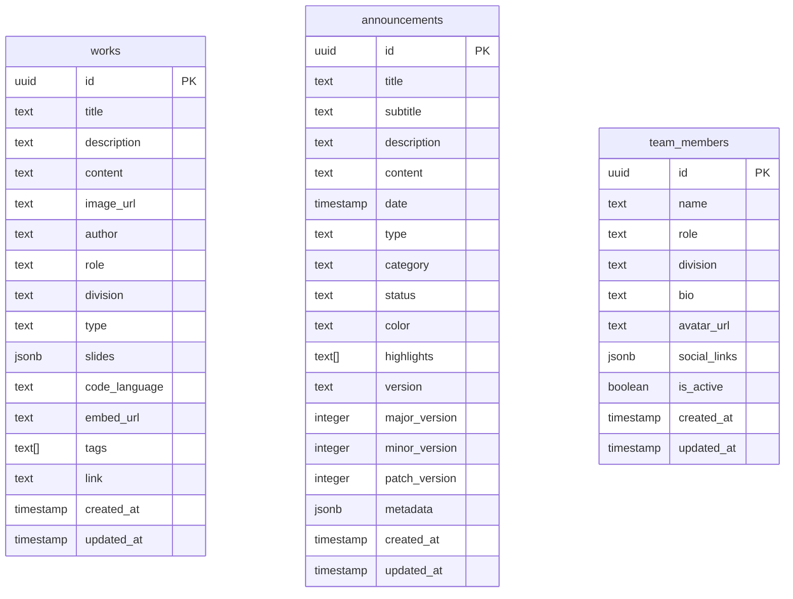

# 🗄️ Dokumentasi Database

Panduan lengkap struktur database OurCreativity menggunakan Supabase (PostgreSQL).

## 📊 Schema Overview



## 📋 Tabel

### 1. `works` (Karya)

Menyimpan karya-karya kreator.

| Kolom | Tipe | Deskripsi |
|-------|------|-----------|
| `id` | UUID | Primary key |
| `title` | TEXT | Judul karya |
| `description` | TEXT | Deskripsi singkat |
| `content` | TEXT | Konten (untuk teks/kode) |
| `image_url` | TEXT | URL gambar |
| `author` | TEXT | Nama pembuat |
| `role` | TEXT | Peran (contoh: '3D Artist') |
| `division` | TEXT | Divisi: graphics, video, writing, coding, meme |
| `type` | TEXT | Tipe: image, video, text, code, slide, embed, document |
| `slides` | JSONB | Array slide untuk tipe 'slide' |
| `code_language` | TEXT | Bahasa pemrograman untuk tipe 'code' |
| `embed_url` | TEXT | URL embed untuk tipe 'embed' |
| `tags` | TEXT[] | Array tag |
| `link` | TEXT | Link eksternal |

### 2. `announcements` (Pengumuman)

Menyimpan pengumuman dan changelog.

| Kolom | Tipe | Deskripsi |
|-------|------|-----------|
| `id` | UUID | Primary key |
| `title` | TEXT | Judul pengumuman |
| `subtitle` | TEXT | Subjudul |
| `description` | TEXT | Ringkasan singkat |
| `content` | TEXT | Konten lengkap |
| `date` | TIMESTAMP | Tanggal pengumuman |
| `type` | TEXT | 'announcement' atau 'changelog' |
| `category` | TEXT | Kategori (Launch, Event, dll) |
| `status` | TEXT | Status (Baru, Selesai, dll) |
| `color` | TEXT | Tailwind gradient classes |
| `highlights` | TEXT[] | Array highlight |
| `version` | TEXT | Versi (untuk changelog) |

### 3. `team_members` (Anggota Tim)

Menyimpan data anggota tim.

| Kolom | Tipe | Deskripsi |
|-------|------|-----------|
| `id` | UUID | Primary key |
| `name` | TEXT | Nama anggota |
| `role` | TEXT | Peran/jabatan |
| `division` | TEXT | Divisi |
| `bio` | TEXT | Biografi |
| `avatar_url` | TEXT | URL foto profil |
| `social_links` | JSONB | Link sosial media |
| `is_active` | BOOLEAN | Status aktif |

## 🔐 Row Level Security (RLS)

Semua tabel menggunakan RLS untuk keamanan.

### Policies Saat Ini

```sql
-- Public read access (semua orang bisa baca)
CREATE POLICY "Public read access for works" 
  ON works FOR SELECT USING (true);

CREATE POLICY "Public read access for announcements" 
  ON announcements FOR SELECT USING (true);

CREATE POLICY "Public read access for team_members" 
  ON team_members FOR SELECT USING (true);
```

### Menambah Write Access (Admin)

Untuk menambah kemampuan write (untuk admin panel):

```sql
-- Contoh: Hanya authenticated users bisa insert
CREATE POLICY "Authenticated users can insert works"
  ON works FOR INSERT 
  WITH CHECK (auth.role() = 'authenticated');
```

## 📝 Migrations

File migrasi tersedia di `supabase/migrations/`.

### Menjalankan Migrasi

```bash
# Menggunakan Supabase CLI
supabase db push
```

### Membuat Migrasi Baru

```bash
supabase migration new nama_migrasi
```

## 🔧 Contoh Query

### Mengambil semua karya dari divisi tertentu

```typescript
const { data, error } = await supabase
  .from('works')
  .select('*')
  .eq('division', 'graphics')
  .order('created_at', { ascending: false });
```

### Mengambil changelog terbaru

```typescript
const { data, error } = await supabase
  .from('announcements')
  .select('*')
  .eq('type', 'changelog')
  .order('date', { ascending: false })
  .limit(10);
```

### Mengambil anggota tim aktif

```typescript
const { data, error } = await supabase
  .from('team_members')
  .select('*')
  .eq('is_active', true);
```

## 📁 File Terkait

- `supabase_schema.sql` - Schema utama
- `supabase_seed.sql` - Data contoh
- `supabase_seed_refocused.sql` - Data contoh minimal
- `supabase_seed_changelog.sql` - Data changelog
